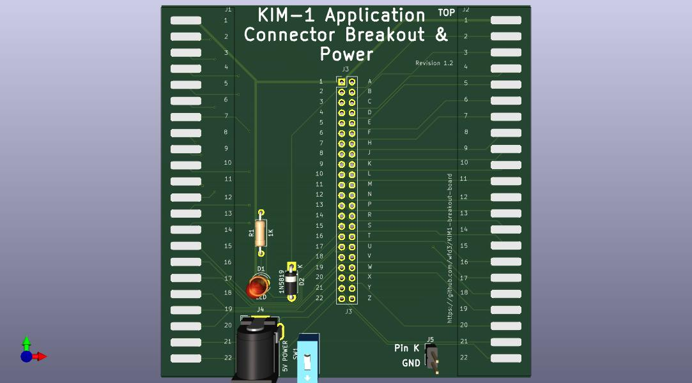

This is a power and breakout board for the [KIM-1](https://en.wikipedia.org/wiki/KIM-1) computer.  It attaches to the Application on the KIM-1 and provides power to the 5v rail.  It also provides a convenient jumper to tie pin A-K to Ground, as specified on page 8 and described further on page 72 in the [KIM-1 User Manual](https://web.archive.org/web/20141129191838if_/http://archive.6502.org/books/kim1_user_manual.pdf). Additionally, it brings the signals out to a standard 2x22 pin header, as well to an edge connector on the other side of the PCB.  This allows easy integration with a breadboard for prototyping, or debugging the data flow between the KIM-1 and other external boards. Note that this board can be used without being connected to external power itself; in this configuration it acts as a passive breakout connector.

The parts required are:

- [Dual Edge Connector](https://google.com/search?q=305-044-500-202) from EDIC (part no. 305-044-500-202),
- 2.45mm pitch pin headers (46 pins in total)
- 1 4mm LED
- 1 1N5819 Diode
- 1 1K Ohm Resistor
- 1 [2.1mm Barrel Jack](https://www.amazon.com/gp/product/B074LK7G86/ref=ppx_yo_dt_b_search_asin_title?ie=UTF8&psc=1)
- 1 [SPST DIP Switch](https://www.amazon.com/uxcell-Switch-Positions-Circuit-Breadboards/dp/B07M9YJKQ6/ref=sr_1_1_pp?dib=eyJ2IjoiMSJ9.uJkUO_Gg5FExfteU9FKYdYdkGBe44__4iJM1u70SQgvvSYEe8slnWx4u6WwADyUS7NciS2RUnmTnugY1CTVEEdRDMkis_MhEHUFiHDGbM9B_TQsupXuHCNE6WdhcmTMpxnsQz5zP4gop-7bjXtEL9fnWJBsv2Peq8ZKPVotDhtx0ySFciCQzC8GIPSMEi2xQv1fC2LRwIUbJoly0rnCXwUgr-y6UW8PROPScFPnGiq0.t7zpLoFr5uSJW29jjs1YwRa0510s8z7lXEuLwGkkBOY&dib_tag=se&keywords=single+dip+switch&qid=1729186888&sr=8-1)
- 1 [5v 2A 2.1mm DC power supply](https://www.amazon.com/dp/B083TTGQ27?ref=ppx_yo2ov_dt_b_fed_asin_title)